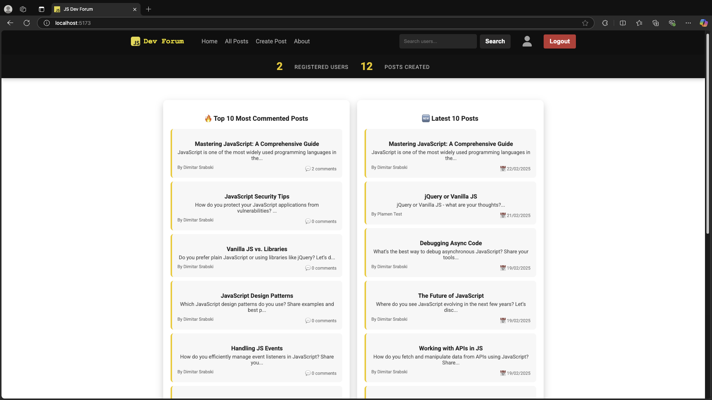
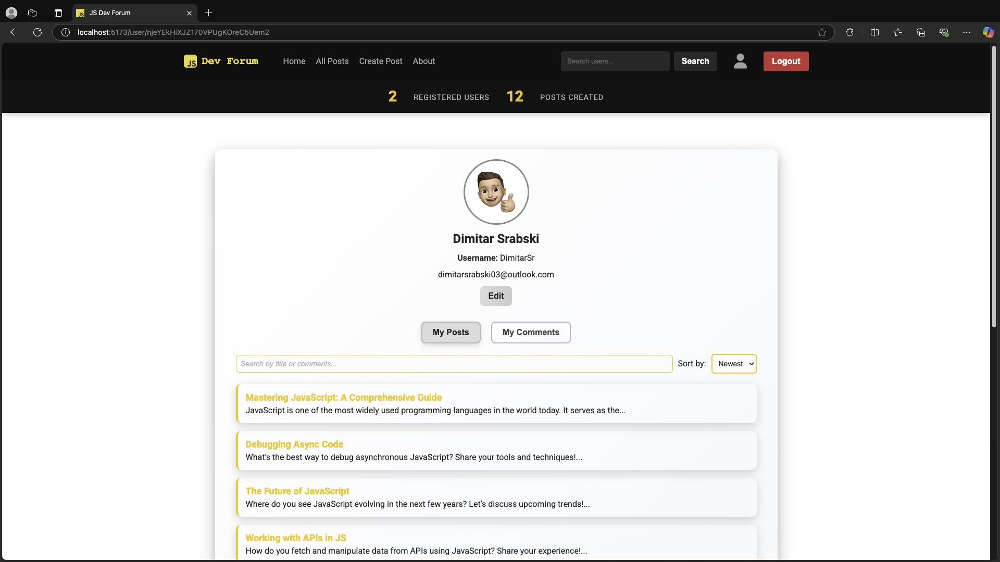

# JS Dev Forum

## Project Description
JS Dev Forum is a modern discussion platform built with React + Vite and Firebase. It allows users to create posts, add comments, like/dislike posts, and engage in discussions about JavaScript.

## Features

### Public Features
- View the top 10 most commented and 10 most recent posts.
- Register and log in using Firebase Authentication.

### User Features
- Create and delete personal posts and comments (editing comments is not allowed).
- Sort and filter posts by newest, oldest, and search by title.
- View detailed posts, including comments, likes, and votes.
- Update profile (only change first name and last name, username remains unchanged).
- Like or dislike posts.
- Browse all posts with sorting and filtering options.
- Reset forgotten passwords via Firebase authentication system.

### Admin Features
- Search for users by username.
- Block/unblock users (blocked users lose all access to the application).
- Delete any post or comment.
- View all posts with filtering and sorting options.

## Technologies Used
- **Frontend**: React (Vite)
- **Backend**: Firebase (Realtime Database & Authentication)
- **Styling**: CSS
- **State Management**: Context API
- **Routing**: React Router
- **Notifications**: react-toastify

## Getting Started

### Installation Steps
1. Clone the repository:
    ```sh
    git clone https://github.com/Giphy-App-Team-01/forum-system-team-01.git
    cd forum-system-team-01
    ```
2. Install dependencies:
    ```sh
    npm install
    ```
3. Set up environment variables:
    - Create a `.env` file in the root directory.
    - Add your Firebase credentials:
    ```env
    VITE_FIREBASE_API_KEY=your_api_key
    VITE_FIREBASE_AUTH_DOMAIN=your_auth_domain
    VITE_FIREBASE_PROJECT_ID=your_project_id
    VITE_FIREBASE_STORAGE_BUCKET=your_storage_bucket
    VITE_FIREBASE_MESSAGING_SENDER_ID=your_messaging_sender_id
    VITE_FIREBASE_APP_ID=your_app_id
    VITE_FIREBASE_DATABASE_URL=your_database_url
    ```
4. Run the project:
    ```sh
    npm run dev
    ```
5. Open in browser:
    - The app will be available at [http://localhost:5173](http://localhost:5173).

## Project Structure
```bash
/forum-system-team-01
│── src/                   # Source code of the application
│   ├── api/               # Firebase API calls (authentication, CRUD operations)
│   ├── assets/            # Static assets such as icons, images, and styles
│   ├── common/            # Constants
│   ├── components/        # Reusable UI components (buttons, modals, cards, etc.)
│   ├── context/           # Context API for global state management
│   ├── hoc/               # Higher-Order Components (HOC) for wrapping logic
│   ├── views/             # Page components (Home, Profile, Post, Admin, etc.)
│   ├── utils/             # Utility/helper functions.
│   ├── App.jsx            # Root component that defines the app structure
│   ├── main.jsx           # Application entry point (renders App.jsx)
│── .env                   # Environment variables (Firebase credentials, API keys)
│── .gitignore             # Specifies files & folders to ignore in Git
│── eslint-config.js       # ESLint configuration for code formatting and linting
│── firebase-config.js     # Firebase setup and initialization
│── index.html             # Main HTML template file used by Vite
│── package.json           # Project dependencies, scripts, and metadata
│── package-lock.json      # Auto-generated file for locking dependencies
│── vite.config.js         # Vite configuration settings
│── README.md              # Documentation about the project
```

## Some screenshots

### Home Page


### All Posts


### Post View


### Create Post


### User Profile



## License
This project is licensed under the MIT License.